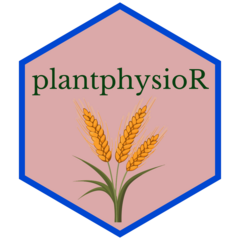

# plantphysioR 

The goal of plantphysioR is to provide basic functions related to plant physiology, it contains functions related to various yield related indices, pigment content calculations and PEG6000 calculations

## Installation

You can install the development version of plantphysioR from [GitHub](https://https://github.com/rameshram96/plantphysioR) with:

``` r
# install.packages("devtools")
devtools::install_github("rameshram96/plantphysioR")
```

## Example

Mp\<-mean(yield_data \$ Yp)

Ms\<-mean(yield_data \$ Ys)

Yp\<-yield_data \$ Yp

Ys\<-yield_data\$Ys

all_indices(Yp,Ys,Mp,Ms)

This function calculates all the yield related indices inclued in the package

``` r
library(plantphysioR)
## basic example code
ss_index(500, 350, 450, 370)
```
